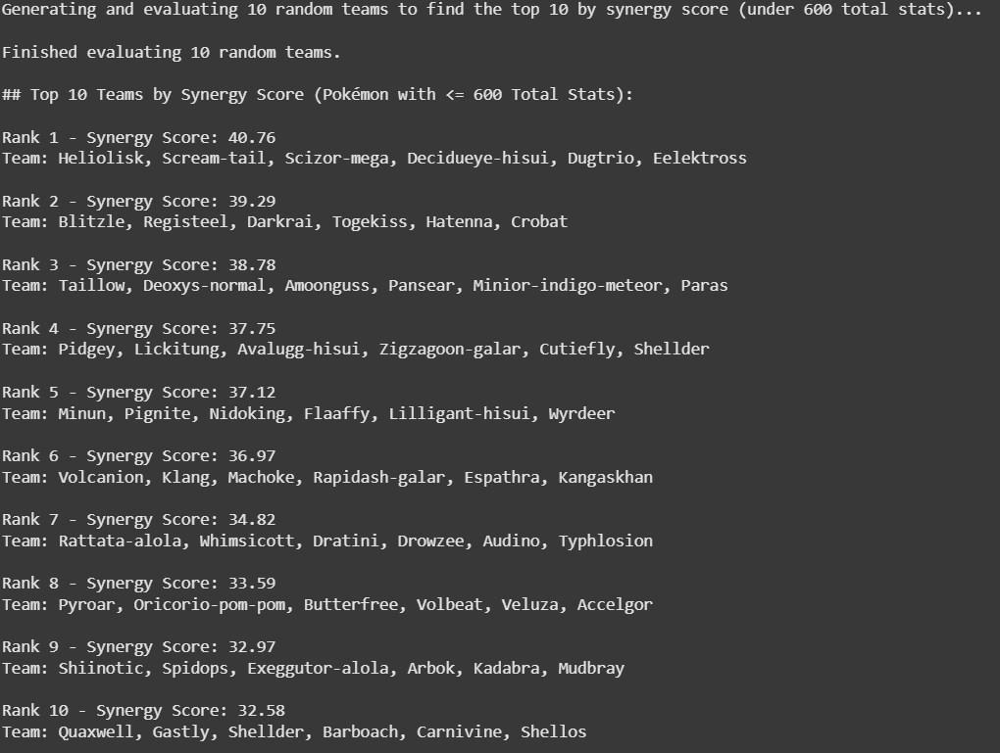

# POKEMON PREDICTIVE MODELING Project
### Using API, Kaggle datasets, and creating a similar battle model to pokemon, I attempted to create a predictive model via creation of composite scoring of 6-pokemon teams (synergy Scores)

# Program used
## python via spider and google collab

## How was the data cleaned or transformed? 
### I pulled all data from pokeapi and coded equations that dictate similar patterns and damage to that of the pokemon franchise

## Currently, the best way I have found to create a predictive model for a team was create a synergy score that would be a quanitative expression encompassing things such as pokemon type and move type for coverage and bonus damage, as well as abilities and individualized stat distribution 
# Pokémon Predictive Model

This project builds a predictive model to analyze and forecast battle outcomes based on Pokémon stats, synergy scores, and team composition.



#To evaluate best teams, I used K-means Clustering to catergorize what each type of pokemon fall under


## Example equation: Final damage calculation
### final_damage = base_damage * stab_multiplier * effectiveness * crit_multiplier * item_boost * random_factor


### This data is strictly for experimentation purposes and I do not receive, nor look to receive compensation from this data owned by any and all entities surround the Pokemon franchise.

## Dependencies

This project uses the following Python libraries:

- **pandas** – data cleaning, manipulation, and analysis  
- **numpy** – numerical operations and arrays  
- **matplotlib** – plotting and visualizations  
- **seaborn** – enhanced data visualizations (optional)  
- **scikit-learn** – clustering and predictive modeling  
- **requests** – retrieving data from the PokéAPI  
- **json** – parsing API responses  
- **itertools** – generating team combinations  
- **random** – randomizing team selection  

### Installation

To install the required dependencies, run:

```bash
pip install pandas numpy matplotlib seaborn scikit-learn requests
pip install notebook ipywidgets
